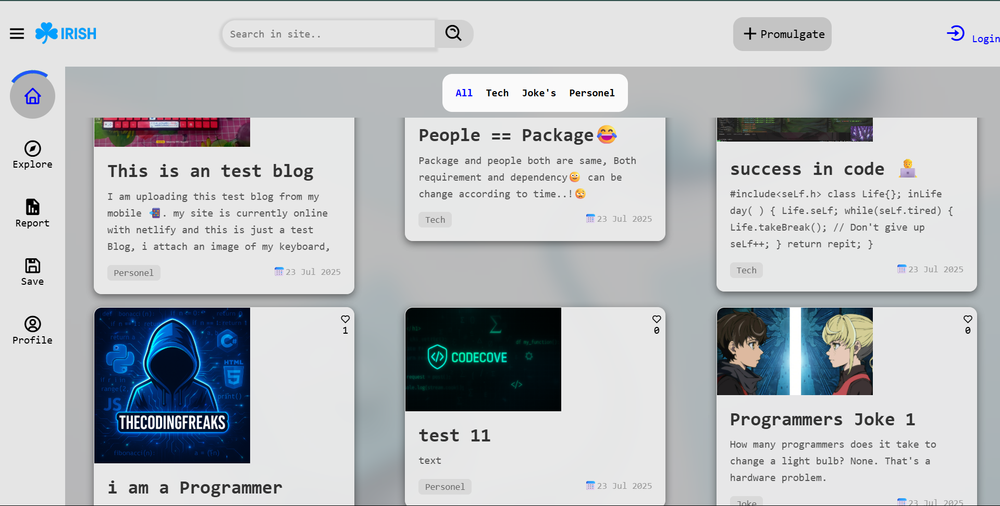

# 🌐 IRISH — A React + Firebase Blog Platform

 

**IRISH** is a clean, modern blogging platform built using **React** and **Firebase Realtime Database**, where users can share blogs about **tech**, **personal life**, and **programming humor**. Users can interact with content, explore others’ profiles, report inappropriate posts, and follow fellow writers.

## ✨ Features

### 🧑‍💻 For Users:
- ✅ **Authentication** with Firebase
- 📝 **Write Blogs** in categories like `Tech`, `Joke`, and `Personal`
- 📷 **Attach Images** to blogs
- 👍 **Like & Interact** with other blogs
- 🧾 **Save** blogs to your collection
- 🧑‍🤝‍🧑 **Explore** other users' profiles and follow them
- 🚩 **Report** blogs for plagiarism or hate content

### 🛡️ For Admins:
- 🕵️ **Review reports** from users
- ⛔ **Suspend** or **ban** users (temporary or permanent)

---

## 🔧 Tech Stack

| Technology | Description                     |
|------------|---------------------------------|
| React      | Frontend framework              |
| Firebase   | Realtime DB + Auth              |
| Netlify    | Hosting (Live Deployment)       |
| CSS        | Custom styling for UI/UX        |

---

## 📂 Project Structure
```
Irish
├── public/                  
├── src/                     
│   ├── assets/              
│   ├── Component/           
│   ├── lib/                 
│   ├── Page/                
│   └── Root.jsx             
├── .gitignore               
├── index.html               
├── package.json             
├── vite.config.js           
└── README.md                
```
## ⚙️Also create a .env > VITE_API_KEY = Your firekey here

## 📄 License

This project is open source for personal and non-commercial use.  
Commercial use requires permission.  
Please read the [LICENSE](./LICENSE) file for full terms.
